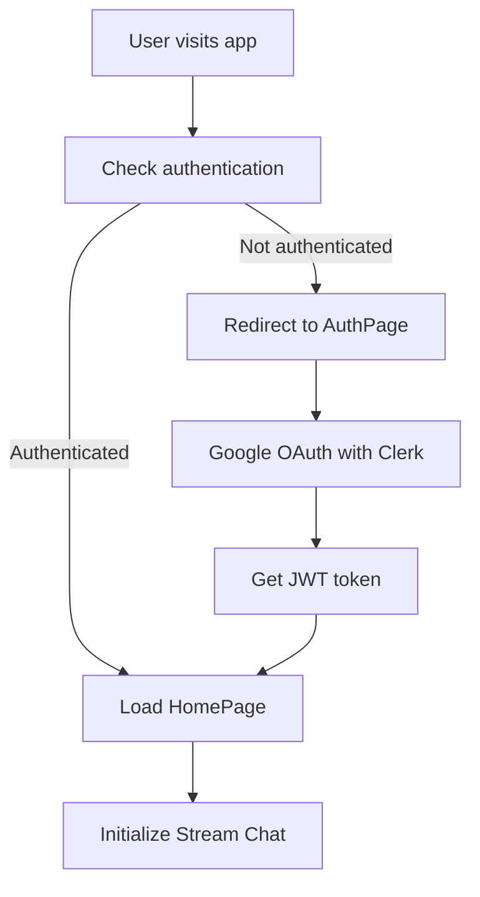

# 🚀 Speclap - Modern Slack Clone

<div align="center">


**A modern, real-time chat application built with React, Node.js, and Stream Chat**

[](https://speclap-frontend.vercel.app)
[](https://slack-backend-indol.vercel.app)
[](https://reactjs.org/)
[](https://nodejs.org/)
[](https://getstream.io/)

</div>

---

## ✨ Features

### 🔐 **Authentication & Security**
- **Google OAuth Integration** with Clerk
- **Secure JWT Token Management**
- **Protected Routes** and API endpoints
- **Real-time User Status** tracking

### 💬 **Real-time Chat**
- **Instant Messaging** with Stream Chat
- **Channel Management** (Create, Join, Leave)
- **Direct Messages** and Group Chats
- **Message Threading** and Replies
- **File Sharing** and Media Support
- **Message Search** and History

### 📹 **Video Calling**
- **HD Video Calls** with Stream Video SDK
- **Screen Sharing** capabilities
- **Call Recording** and Management
- **Multi-participant** video conferences

### 🎨 **Modern UI/UX**
- **Responsive Design** for all devices
- **Dark/Light Theme** support
- **Custom Slack-inspired** interface
- **Smooth Animations** and transitions
- **Mobile-first** approach

### 🚀 **Performance & Reliability**
- **Real-time Updates** with WebSocket connections
- **Optimistic UI** updates
- **Error Handling** and recovery
- **Loading States** and feedback
- **Offline Support** (coming soon)

---

## 🛠️ Tech Stack

### **Frontend**
- **React 19.1.1** - Modern UI library
- **Vite** - Lightning-fast build tool
- **Tailwind CSS** - Utility-first styling
- **React Query** - Server state management
- **React Router** - Client-side routing
- **Stream Chat React** - Chat components
- **Stream Video React** - Video calling
- **Clerk** - Authentication
- **Axios** - HTTP client
- **React Hot Toast** - Notifications

### **Backend**
- **Node.js** - JavaScript runtime
- **Express.js** - Web framework
- **MongoDB** - NoSQL database
- **Mongoose** - ODM for MongoDB
- **Stream Chat SDK** - Chat backend
- **Clerk Express** - Authentication middleware
- **CORS** - Cross-origin resource sharing
- **Sentry** - Error monitoring
- **Inngest** - Background job processing

### **Deployment**
- **Vercel** - Frontend & Backend hosting
- **MongoDB Atlas** - Cloud database
- **Environment Variables** - Configuration management

---

## 🚀 Quick Start

### Prerequisites
- **Node.js** (v18 or higher)
- **npm** or **yarn**
- **MongoDB** (local or Atlas)
- **Stream.io** account
- **Clerk** account

### 1. Clone the Repository
```bash
git clone https://github.com/SubhanRahiman7/speclap.git
cd speclap
```

### 2. Backend Setup
```bash
cd backend
npm install

# Create .env file
cp .env.example .env
# Edit .env with your credentials

# Start development server
npm run dev
```

### 3. Frontend Setup
```bash
cd frontend
npm install

# Create .env file
cp .env.example .env
# Edit .env with your credentials

# Start development server
npm run dev
```

### 4. Environment Variables

#### Backend (.env)
```env
PORT=5001
MONGO_URI=mongodb://localhost:27017/speclap
NODE_ENV=development
CLERK_PUBLISHABLE_KEY=pk_test_...
CLERK_SECRET_KEY=sk_test_...
STREAM_API_KEY=your_stream_api_key
STREAM_API_SECRET=your_stream_api_secret
SENTRY_DSN=your_sentry_dsn
INGEST_EVENT_KEY=your_inngest_key
INGEST_SIGNING_KEY=your_inngest_signing_key
CLIENT_URL=http://localhost:5173
```

#### Frontend (.env)
```env
VITE_CLERK_PUBLISHABLE_KEY=pk_test_...
VITE_STREAM_API_KEY=your_stream_api_key
VITE_SENTRY_DSN=your_sentry_dsn
VITE_API_BASE_URL=http://localhost:5001/api
```

---

## 📁 Project Structure

```
speclap/
├── 📁 backend/
│   ├── 📁 src/
│   │   ├── 📁 config/          # Database, environment, Stream config
│   │   ├── 📁 controllers/     # API route handlers
│   │   ├── 📁 middleware/       # Custom middleware
│   │   ├── 📁 models/          # Database models
│   │   ├── 📁 routes/          # API routes
│   │   └── server.js           # Main server file
│   ├── package.json
│   └── vercel.json
├── 📁 frontend/
│   ├── 📁 src/
│   │   ├── 📁 components/      # Reusable UI components
│   │   ├── 📁 hooks/           # Custom React hooks
│   │   ├── 📁 lib/             # Utilities and API calls
│   │   ├── 📁 pages/           # Page components
│   │   ├── 📁 providers/       # Context providers
│   │   └── 📁 styles/          # CSS and themes
│   ├── 📁 public/              # Static assets
│   ├── package.json
│   └── vercel.json
└── README.md
```

---

## 🎯 Key Features Deep Dive

### 🔐 **Authentication Flow**


### 💬 **Real-time Chat Architecture**
- **Stream Chat SDK** for real-time messaging
- **WebSocket connections** for instant updates
- **Message persistence** in MongoDB
- **Channel management** with permissions
- **File upload** and media sharing

### 📹 **Video Calling System**
- **Stream Video SDK** for HD video calls
- **WebRTC** for peer-to-peer connections
- **Screen sharing** capabilities
- **Call recording** and management
- **Multi-participant** support

---

## 🚀 Deployment

### **Frontend (Vercel)**
1. Connect your GitHub repository to Vercel
2. Set environment variables in Vercel dashboard
3. Deploy automatically on push to main branch

### **Backend (Vercel)**
1. Deploy backend as Vercel serverless functions
2. Configure environment variables
3. Set up MongoDB Atlas connection
4. Configure CORS for frontend domain

### **Database (MongoDB Atlas)**
1. Create MongoDB Atlas cluster
2. Configure network access
3. Get connection string
4. Update environment variables

---

## 🔧 Development

### **Available Scripts**

#### Backend
```bash
npm run dev      # Start development server with nodemon
npm start        # Start production server
```

#### Frontend
```bash
npm run dev      # Start Vite development server
npm run build    # Build for production
npm run preview  # Preview production build
npm run lint     # Run ESLint
```

### **Code Quality**
- **ESLint** for code linting
- **Prettier** for code formatting
- **TypeScript** support (coming soon)
- **Testing** with Jest (coming soon)


---

<div align="center">

**Made with ❤️ by [Subhan Rahiman](https://github.com/SubhanRahiman7)**

[](https://github.com/SubhanRahiman7)
[](https://www.linkedin.com/in/subhan-rahiman-b307b92b1/)
[](https://x.com/subhan1738897)

</div>
